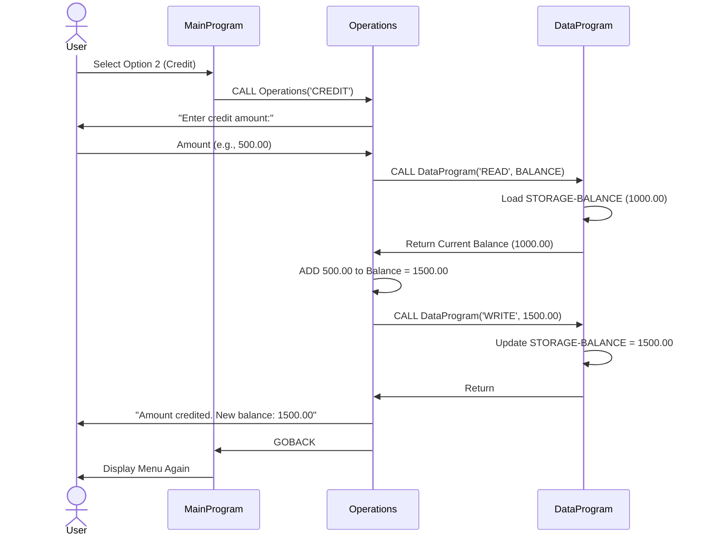
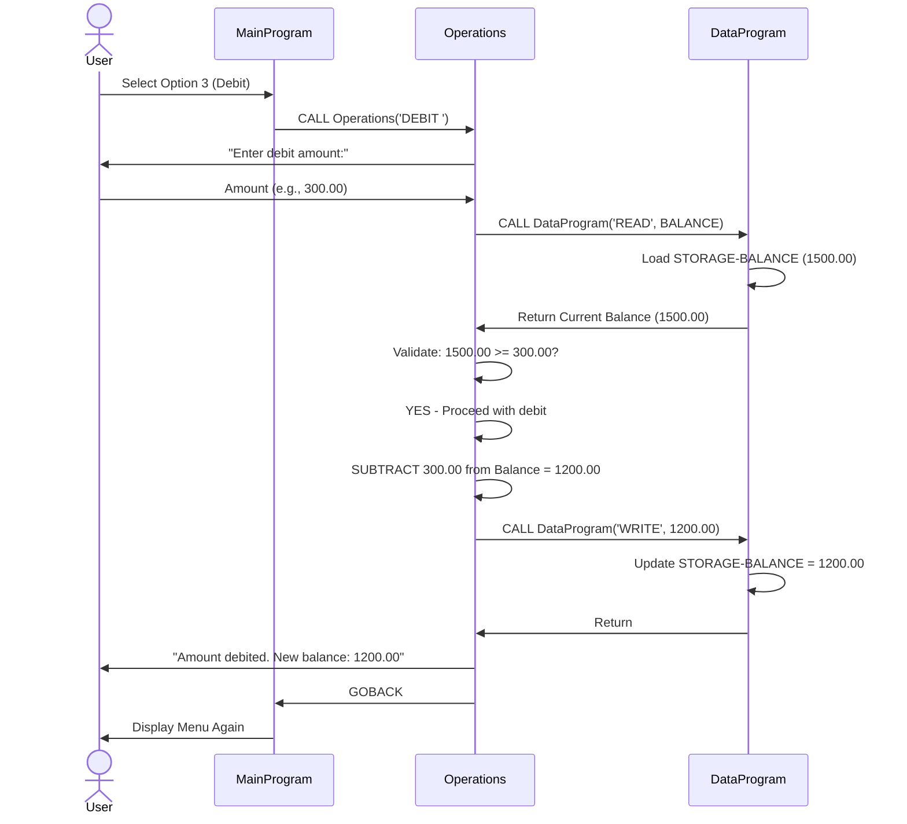
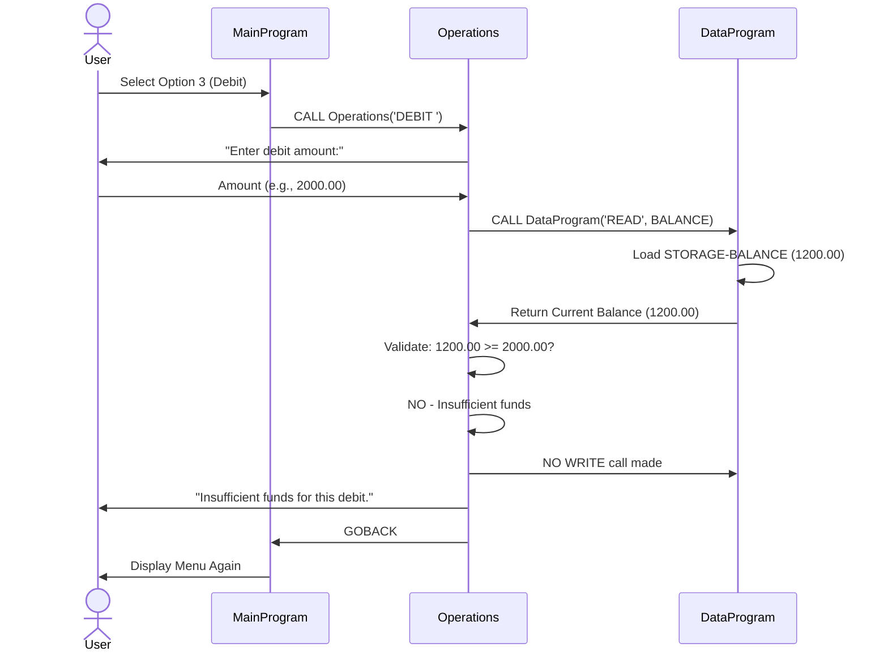
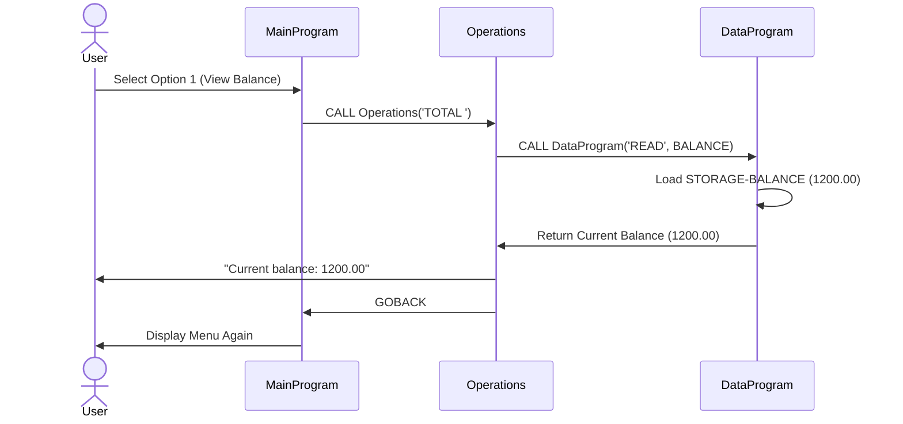

# Student Account Management System - COBOL Documentation

## Overview
This is a legacy COBOL-based Student Account Management System designed to handle basic banking operations for student accounts. The system provides a menu-driven interface for viewing balances and managing account transactions (credits and debits).

---

## COBOL Files Documentation

### 1. **main.cob** - Main Program Entry Point
**Purpose:** Serves as the primary user interface and orchestrator for the account management system.

**Key Functions:**
- Displays a menu-driven interface with four options
- Accepts user input to navigate between operations
- Maintains program flow using a loop until user chooses to exit
- Delegates specific operations to the `Operations` program

**Menu Options:**
- **Option 1:** View Balance (calls `Operations` with 'TOTAL ' parameter)
- **Option 2:** Credit Account (calls `Operations` with 'CREDIT' parameter)
- **Option 3:** Debit Account (calls `Operations` with 'DEBIT ' parameter)
- **Option 4:** Exit (terminates the program)

**Key Variables:**
- `USER-CHOICE`: Stores the menu choice (1-4)
- `CONTINUE-FLAG`: Controls the main loop execution (YES/NO)

---

### 2. **operations.cob** - Business Logic Handler
**Purpose:** Implements the core business logic for account transactions and acts as a bridge between the user interface and data storage.

**Key Functions:**

#### **TOTAL - View Account Balance**
- Calls `DataProgram` to read current balance from storage
- Displays the current account balance to the user
- No account modifications occur

#### **CREDIT - Add Funds to Account**
- Prompts user to enter the credit amount
- Reads the current balance from storage
- Adds the entered amount to the current balance
- Writes the new balance back to storage
- Displays the updated balance to the user

#### **DEBIT - Withdraw Funds from Account**
- Prompts user to enter the debit amount
- Reads the current balance from storage
- **Validates sufficient funds** before processing the transaction
- If funds are sufficient: subtracts amount and updates storage
- If funds are insufficient: displays error message and does NOT process the debit
- Displays the new balance or error message accordingly

**Key Variables:**
- `OPERATION-TYPE`: Stores the operation to perform (TOTAL/CREDIT/DEBIT)
- `AMOUNT`: Stores the transaction amount (used for credit/debit operations)
- `FINAL-BALANCE`: Stores the account balance before and after operations

---

### 3. **data.cob** - Data Storage Management
**Purpose:** Provides centralized data persistence for student account balances. Acts as the data access layer for the system.

**Key Functions:**

#### **READ Operation**
- Retrieves the current account balance from storage
- Passes the balance to the calling program via the LINKAGE SECTION

#### **WRITE Operation**
- Receives a balance value from the calling program
- Updates the stored account balance
- Persists the new balance in storage

**Key Variables:**
- `STORAGE-BALANCE`: Holds the persistent account balance (initialized to 1000.00)
- `OPERATION-TYPE`: Determines whether to READ or WRITE data
- `BALANCE`: Interface variable for passing balance data to/from calling programs

---

## Business Rules for Student Accounts

### **Mandatory Rules**
1. **Initial Balance:** Every student account starts with a balance of **1000.00**

2. **Debit Validation:** 
   - A debit (withdrawal) can only be processed if the account has sufficient funds
   - The debit amount must NOT exceed the current balance
   - If insufficient funds exist, the transaction is rejected and the user receives an error message

3. **Credit Transactions:** 
   - Credits (deposits) have no upper limit
   - Credits are always accepted without validation

4. **Balance Persistence:**
   - The account balance persists between transactions within a session
   - The `DataProgram` maintains the balance in working storage

### **User Interaction Rules**
1. Menu-driven interface only; invalid selections (non 1-4 values) display an error message
2. Users must explicitly select "Exit" to end the program
3. All transactions display confirmation messages with the new balance

### **Data Format Rules**
- **Balance Format:** PIC 9(6)V99 (up to 999,999.99 with two decimal places)
- **Operation Codes:** 6-character strings (e.g., 'TOTAL ', 'CREDIT', 'DEBIT ')
- **Amount Format:** PIC 9(6)V99 (same as balance)

---

## System Architecture

```
┌──────────────────┐
│   main.cob       │  (Menu & User Interface)
│  MainProgram     │
└────────┬─────────┘
         │ CALL
         ↓
┌──────────────────┐
│  operations.cob  │  (Business Logic)
│   Operations     │
└────────┬─────────┘
         │ CALL
         ↓
┌──────────────────┐
│   data.cob       │  (Data Persistence)
│  DataProgram     │
└──────────────────┘
```

---

## Execution Flow

1. **Program Start:** `MainProgram` displays the menu
2. **User Input:** User selects an option (1-4)
3. **Operation Dispatch:** `Operations` program is called with the appropriate operation code
4. **Business Logic:** `Operations` executes the transaction logic
5. **Data Access:** `DataProgram` is called to read or write balance data
6. **Result Display:** User sees transaction results and confirmation
7. **Loop:** Returns to menu or exits based on user choice

---

## Notes for Maintenance

- The system uses COBOL's `CALL` statement for inter-program communication
- The `LINKAGE SECTION` is used to pass parameters between programs
- Balance calculations use fixed-point decimal arithmetic (V99 notation)
- The system is single-threaded and session-based (no multi-user support)

---

## Data Flow Sequence Diagrams

### **Diagram 1: Credit Transaction Flow**



### **Diagram 2: Debit Transaction Flow (Sufficient Funds)**



### **Diagram 3: Debit Transaction Flow (Insufficient Funds)**



### **Diagram 4: View Balance Flow**


